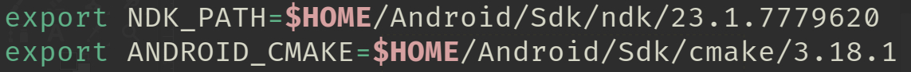

# opensa-mod (Deprecated, see sa-mobile)
**This project aims to perform _Gaming Hacking_ techniques for achievement some objectives, all modifications is only for studies purposes and just works on ARMv8-a devices!**

## Tooling in use
- Cmake
- Ninja
- Python3
- Android Studio
- NDK (Android Native Development Kit)

## Build configuration
- What you will need to configure in your current shell/Windows Path environment:

Expose NDK_PATH and CMAKE_ANDROID paths env variable, example:


## Creating build directory
- Just type at root level folder (```OpenSA```):

~~~bash
OpenSA> python3 scripts/opensa.py -b
~~~

After the command successed, a new directory called ```build``` will be appear inside your root (OpenSA) folder, follows the next step!

## Building the plugin

## How to compile
Enter into the build dir and run 'ninja':
~~~bash
OpenSA> cd build
build> ninja install
~~~

After this, a shared object file called **libOpenSA.so** must be generated, this is own plugin and you mst install inside your Android Package game object in ```lib/arm64-v8a/libOpenSA.so```. The same **.APK** object must be infected by our Dalvik Smali script, all you need is this file inside of: ```OpenSA/smali/GTASA.smali```

> All others libraries needed will be inside of `output` directory at the project root structure
## How to clean
Clean all objects generated by the NDK compiler:
~~~bash
build> ninja clean
OpenSA> rm -rf output
~~~

